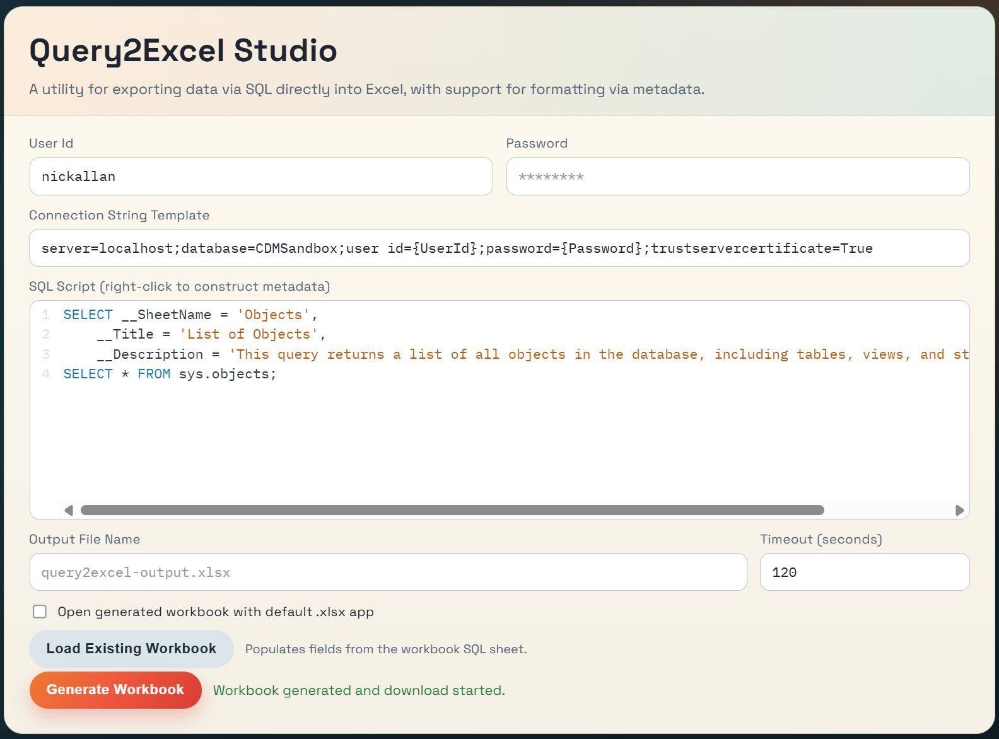

# Query2Excel

A utility for exporting data via SQL directly into Excel, with support for formatting via metadata.


Main UI where you provide credentials, enter SQL, and generate the workbook.


Example output worksheet showing query results rendered into formatted Excel tables.


Companion SQL worksheet capturing execution details, SQL text, and sanitized connection template.

## Quickstart

Use this path to get running fast on Windows.

1. Prerequisite: install .NET 8 SDK.

2. Set web credentials in User Secrets:

```powershell
dotnet user-secrets --project .\Query2Excel.Web set "Query2ExcelWeb:DatabaseUserId" "YOUR_USER_ID"
dotnet user-secrets --project .\Query2Excel.Web set "Query2ExcelWeb:DatabasePassword" "YOUR_PASSWORD"
dotnet user-secrets --project .\Query2Excel.Web set "Query2ExcelWeb:ConnectionStringTemplate" "Server=YOUR_SERVERNAME;Database=YOUR_DATABASENAME;User Id={UserId};Password={Password};TrustServerCertificate=True;"
```

3. Start the web app:

```powershell
.\launch-web.bat
```

4. In the browser:

- Enter or confirm User Id, Password, and connection string template.
- Paste SQL into SQL Script.
- Click Generate Workbook.
- Download starts automatically when output is a file name.

Optional health check:

```powershell
dotnet build .\Query2Excel.sln
dotnet test .\Query2Excel.sln
```

## What You Get

- Browser-based SQL to Excel generation using the same Core engine as the console app.
- Metadata-driven worksheet naming/layout and append behavior.
- SQL worksheet with execution details and credential-safe connection template.
- Workbook reload workflow from existing Query2Excel output.

## Solution Layout

- Query2Excel.Core: Shared business logic, contracts, SQL execution, metadata parsing, and workbook generation.
- Query2Excel.App: Console host for script-driven/local automation workflows.
- Query2Excel.Web: Browser host that uses the same Core services.
- Query2Excel.Tests: Unit tests covering Core and host validation behavior.

## Build And Test

```powershell
dotnet build .\Query2Excel.sln
dotnet test .\Query2Excel.sln
```

## Running Hosts

Fastest Windows path:

```powershell
.\launch-web.bat
```

Direct host commands:

Console host:

```powershell
dotnet run --project .\Query2Excel.App
```

Web host:

```powershell
dotnet run --project .\Query2Excel.Web
```

Then open the printed local URL and use the form to generate a workbook.

Launcher details:

- Resolves the web project path from the repository root.
- Verifies `dotnet` is available on `PATH`.
- Starts `Query2Excel.Web` with `dotnet run`.
- Forwards any extra arguments to the web host.

Example with forwarded arguments:

```powershell
.\launch-web.bat --urls http://localhost:5099
```

## Console Configuration

Primary configuration section: `Query2Excel`

- `ConnectionString`
- `ConnectionStringTemplate`
- `DatabaseUserId`
- `DatabasePassword`
- `SqlScript`
- `OutputFilePath`
- `CommandTimeoutSeconds`

Default SQL script path:

```json
"SqlScript": "Query2Excel.App\\Scripts\\Example.sql"
```

CLI options are also supported (`--help`):

- `--connectionString`
- `--connectionStringTemplate`
- `--databaseUserId`
- `--databasePassword`
- `--sqlScript`
- `--outputFilePath`
- `--commandTimeoutSeconds`

The console host accepts tokenized templates using either `{UserId}` / `{Password}` or `{{USER_ID}}` / `{{PASSWORD}}`.

## Web Host Feature Set

- Generate and download `.xlsx` directly from the browser.
- Optional explicit output path behavior:
- If output is a simple file name, browser download is returned.
- If output includes a path component, the server writes the workbook to that path.
- Overwrite-safe save behavior for explicit paths: existing file is versioned as `file.xlsx1`, `file.xlsx2`, and so on.
- Optional "Open generated workbook with default .xlsx app" behavior.
- "Load Existing Workbook" workflow:
- Upload a prior Query2Excel workbook.
- Reads refresh data from SQL worksheet markers.
- Repopulates connection template, SQL script, and output file name in the form.
- SQL editor metadata helper:
- Right-click SQL Script and open "Metadata SELECT Builder".
- Insert or update metadata `SELECT` statements in-place.

## Workbook Output Behavior

If a query returns multiple data result sets:

- Result set 1 -> `Output1`
- Result set 2 -> `Output2`
- Additional sets -> `Output3`, `Output4`, and so on

Workbook always includes an `SQL` worksheet with:

- Execution timestamp (UTC)
- Execution duration (ms)
- Total rows returned
- Result set count
- Connection string template (credentials masked)
- Executed SQL text

## Metadata Result Sets

Metadata controls how the immediately following data result set is rendered.

A result set is treated as metadata only when:

- It has exactly 1 row.
- It has at least 1 column.
- Every column name is a recognized metadata field.

Recognized metadata fields:

- `__SheetName`: Rename the next output sheet.
- `__Title`: Add a title row above the next table.
- `__Description`: Add a description row above the next table.
- `__AppendBelowPreviousTable`: Append next table below previous table on the same sheet (`true/false`, `1/0`, `yes/no`, `on/off`).
- `__RowFormatColumn`: Name of a style-indicator column in the next data result set.

Rules:

- Metadata applies only to the next data result set.
- Metadata result sets are consumed and not emitted as output sheets.
- `__SheetName` cannot be combined with `__AppendBelowPreviousTable`.
- If `__RowFormatColumn` is provided but the named column does not exist in the next result set, workbook generation fails.

Layout rules for title/description:

- `__Title` + `__Description`: title at `A1`, description at `A2`, headers begin at `A3`.
- `__Title` only: title at `A1`, headers begin at `A2`.
- `__Description` only: description at `A1`, headers begin at `A2`.
- Neither: headers begin at `A1`.

## Row Style Configuration

Row style definitions are configuration-driven via:

- `config/Query2Excel.RowStyles.json`

Both hosts load this file at startup. Style names are normalized (case-insensitive and tolerant of spaces, hyphens, and underscores), so names such as `Accent 1`, `accent_1`, and `ACCENT-1` map to the configured `Accent1` style.

When `__RowFormatColumn` is used:

- The style column is used for formatting and excluded from worksheet output.
- Style value `Normal` (or empty) keeps default table formatting.

## Secrets And Credential Handling

Use .NET User Secrets to protect credentials.

Console project secrets:

```powershell
dotnet user-secrets --project .\Query2Excel.App set "ConnectionStrings:Query2Excel" "Server=localhost;Database=CDMSandbox;User Id=YOUR_USER_ID;Password=YOUR_PASSWORD;TrustServerCertificate=True;"
dotnet user-secrets --project .\Query2Excel.App list
```

Web project secrets:

```powershell
dotnet user-secrets --project .\Query2Excel.Web set "Query2ExcelWeb:DatabaseUserId" "YOUR_USER_ID"
dotnet user-secrets --project .\Query2Excel.Web set "Query2ExcelWeb:DatabasePassword" "YOUR_PASSWORD"
dotnet user-secrets --project .\Query2Excel.Web set "Query2ExcelWeb:ConnectionStringTemplate" "Server=localhost;Database=CDMSandbox;User Id={UserId};Password={Password};TrustServerCertificate=True;"
dotnet user-secrets --project .\Query2Excel.Web list
```

Notes:

- The web host can persist provided template/user/password values into its User Secrets file for future runs.
- Workbook SQL sheet stores a sanitized template representation (credential values replaced with tokens).
- Keep `Query2Excel.App/appsettings.json` checked in with empty `ConnectionString`.
